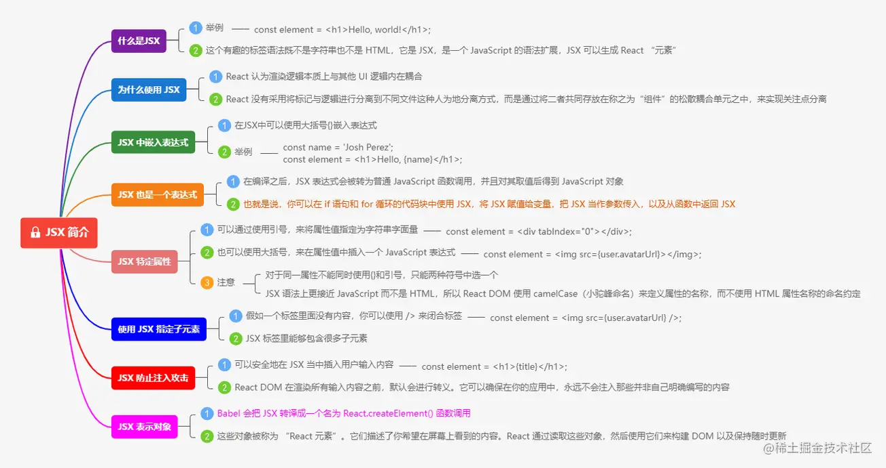

# react源码原理解析：

https://react.iamkasong.com/#%E5%AF%BC%E5%AD%A6%E8%A7%86%E9%A2%91

# jsx简介



## 1.jsx介绍

jsx是什么？ jsx允许我们在javascript中写html代码。并且由babel帮助我们进行编译。 那他的好处是什么？

## 优点分析

### 1、业务逻辑和ui融合

将数据和UI融合在一块，更加符合渲染的逻辑。

### 2、防止XSS攻击

默认情况下，React DOM在渲染它们之前先转义JSX中嵌入的任何值。这样可以确保您永远不会注入未在应用程序中明确编写的任何内容。一切在呈现之前都会转换为字符串。这有助于防止XSS（跨站点脚本）攻击。

会将用户输入的，跟HTML符号相同的转义掉。

```javascript

const element = <div>{message} </div>

```

如果message有任何html字符的话，都会进行转义。

