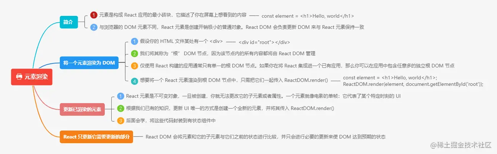

# react源码原理解析：

https://react.iamkasong.com/#%E5%AF%BC%E5%AD%A6%E8%A7%86%E9%A2%91

# 组件 & props




## 声明组件

我们在声明组件的时候需要以大写开头，因为在react render的时候，将大写开头的组件视为自定义组件，而将小写开头的组件视为原生HTML标签或React内置组件。

## props

props 一般用于在子父组件中传递数据，props 是不可修改的，所有 React 组件都必须像纯函数一样保护它们的 props 不被更改。 由于 props 是传入的，并且它们不能更改，因此我们可以将任何仅使用 props 的 React 组件视为 pureComponent，也就是说，在相同的输入下，它将始终呈现相同的输出。

### 批量传递 props

当我们需要批量传递 props 时，可以使用到三点运算符去实现：

```javascript

const p = {name: 'sophia', age: 24, sex: '女'}

ReactDOM.render(<Person {...p} />, document.getElementById("test"));

```

### props的children属性

children可以拿到组件标签内的节点，如果是一个是字符串，这里children属性值就是一个普通的字符串，如果我们传递了一段结构或者一个组件，那么它就是一个对象，如果我们传递了多个结构或者组件，那么它的值就是一个数组。

```javascript

export default const App = ()=>{
    return (
        <Parent>
            children组件
        </Parent>
    )
} 

```