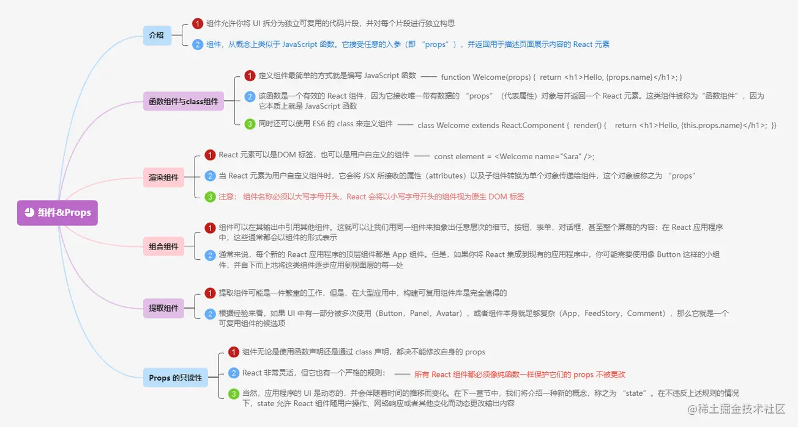

# react源码原理解析：

https://react.iamkasong.com/#%E5%AF%BC%E5%AD%A6%E8%A7%86%E9%A2%91

# 数据量和state 

## 用法

setState第一个参数可以是一个对象，或者是一个函数，而第二个参数是一个回调函数。

第二个回调参数的作用是因为setState是一个异步的过程，所以说执行完setState之后不能立刻更改state里面的值。如果需要对state数据更改监听，setState提供第二个参数，就是用来监听state里面数据的更改，当数据更改完成，调用回调函数，用于可以实时的获取到更新之后的数据
。

## 使用setState更新

不要直接更改state, 虽然state数据也会更新，但是页面并不会重新渲染，使用setState更新。

### setState 发生了什么

调度 ->  render阶段 -> commit阶段

### 调度 reco

### render

### commit阶段

### setState是同步还是异步

setState这个方法在调用的时候是同步的，但是引起React的状态更新是异步的 【React状态更新是异步的】

### 为什么设计成异步

批量更新；